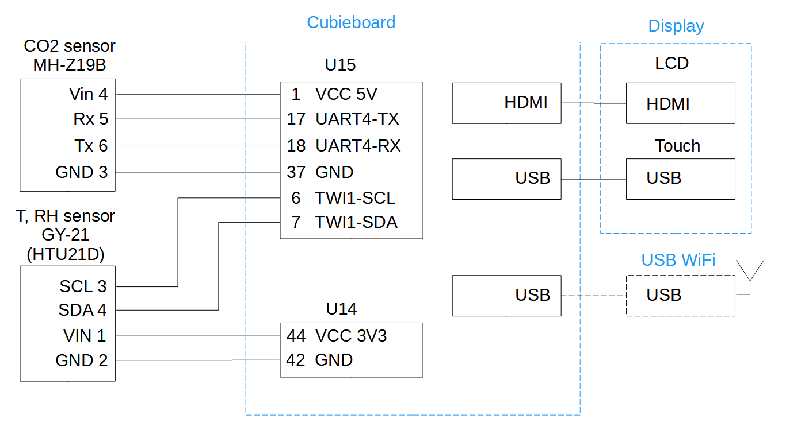

Base information:
============
Application: home meteostation with number of sensors and colour LCD display

Hardware:
 - Main board - Cubieboard1: Allwinner A10 (sun4i), HDMI, Ethernet LAN
 - CO2 sensor - MH-Z19b
 - Temperature and Relative Humidiy sensor - HTU21D
 - Display - 7 inch IPS LCD Wisecoco 1024x600, HDMI, USB touch
 - Support USB WIFI RTL8821CU

Scheme of hardware connections


Software:
 - Yocto linux, based on core image
 - mainline kernel + patched DTS + enabled Cedrus video driver
 - mainline U-boot
 - MH-Z19b CO2 sensor daemon (python3)
 - MQTT broker - Mosquitoo
 - HTU21D Temperature and Relative Humidiy sensor daemon (rust)
 - Graphics - Slint GUI (rust) + gstreamer


meta-meteo layer
============

Dependencies
============

  Layers

  Name,             URL,                                            branch/tag
  - poky              git://git.yoctoproject.org/poky                 "kirkstone"
    - meta
    - meta-poky
    - meta-yocto-bsp
  - meta-openembedded git://git.openembedded.org/meta-openembedded    "kirkstone"
    - meta-oe
    - meta-python
    - meta-networking
  - meta-sunxi        https://github.com/linux-sunxi/meta-sunxi       "kirkstone"
  - meta-rust-bin     https://github.com/rust-embedded/meta-rust-bin  "master"
  - optional for support USB WIFI RTL8821CU
    meta-rtlwifi https://github.com/EmbeddedAndroid/meta-rtlwifi  "master"

Description of modules
=======

- recipes-connecivity/mosquitto - MQTT broker
- recipes-core/psplash - Startup logo
- recipes-core/base-files - For rotating startup logo verticaly
- recipes-extended/timezone - Setup timezone in system
- recipes-kernel/linux - Patched DTS in mainline linux for activate UART4 for CO2 sensor. Enabled Cedar video driver for hardware video decoding.
- recipes-multimedia/gstreamer - Required gstreamer plugins for video converting and decoding
- recipes-python/co2-sensor-daemon - Python application to read sensors data and send it to MQTT broker
- recipes-python/python3-mhz19 - Python module for interact with MH-Z19 CO2 sensor. Pathed in order to get rid of RPI dependencies.
- recipes-rust/htu21d-daemon - Rust daemon for TE HTU21D relative humidity and temperature sensor. Get data from sensor and send it to MQTT broker
- recipes-rust/slint-gui - GUI for meteostation based on Slint - Rust GUI framework, fetch data from MQTT broker
- recipes-rust/weather-provider - Weather data provider, send data to MQTT broker
- recipes-support/ntp - Configure NTP service in order to have real time in system. Need for HTTPS requests
- recipes-support/ntp-waiter - Service for waiting for NTP service synchronization.


HOW TO USE
=================

1. Add layers to bblayers.conf, for example:
  ```
  BBLAYERS ?= " \
  /home/user/work2/yocto/poky/meta \
  /home/user/work2/yocto/poky/meta-poky \
  /home/user/work2/yocto/poky/meta-yocto-bsp \
  /home/user/work2/yocto/poky/meta-sunxi \
  /home/user/work2/yocto/poky/meta-openembedded/meta-oe \
  /home/user/work2/yocto/poky/meta-openembedded/meta-python \
  /home/user/work2/yocto/poky/meta-openembedded/meta-networking \
  /home/user/work2/yocto/my_layers/meta-meteo \
  /home/user/work2/yocto/my_layers/meta-rust-bin \
  "
  # optional for support USB WIFI RTL8821CU:
  /home/user/work2/yocto/my_layers/meta-rtlwifi \
  ```

2. Add to local.conf
  ```
  # mandatory:
  MACHINE ??= "cubieboard"
  MACHINEOVERRIDES .= ":use-mailine-graphics"
  DISTRO = "cubieboard-meteo"
  LICENSE_FLAGS_ACCEPTED = "commercial license"
  ```
  ```
  # optional and depends on build hardware
  BB_NUMBER_THREADS = "4"
  BB_NUMBER_PARSE_THREADS = "8"
  PARALLEL_MAKE = "-j 2"
  PARALLEL_MAKEINST = "-j 2"
  INHERIT += "rm_work"
  ```
  ```
  # optional for support USB WIFI RTL8821CU:
  WIFI_SSID ?= "your wifi SSID"
  WIFI_PASS ?= "your wifi password key" # use wpa_passphrase to generate key
  DISTRO = "cubieboard-meteo-rtl8821cu"
  ```
  ```
  # optional for set your video stream, should be encoded with h264
  OUTDOOR_VIDEO_URI = "video streem URL"
  ```

3. Build: bitbake core-image-meteo
4. Write image on SD card (/dev/sd<X>):
```
sudo dd bs=4M if=<path to image build directory>/tmp/deploy/images/cubieboard/core-image-meteo-cubieboard.sunxi-sdimg of=/dev/sd<X> status=progress && sync /dev/sd<X>
```
5. Insert SD card to Cubieboard, Power ON
